% Misreporting of ideological placement to rationalize party preferences 
% Fridolin Linder[^contact]

[^contact]: Fridolin Linder is a Ph.D. student in political science at Pennsylvania State University ([fridolin.linder@gmail.com](mailto:fridolin.linder@gmail.com)).

\begin{abstract}

\end{abstract}

# Introduction

The connection between individuals' political preferences and individuals' group or party preferences has gained enormous attention from scholars in political science and other social
sciences. It is one basic question that, due to it's high normative relevance, is debated for decades now in political science: Do people have exogenous preferences and form elite/group preferences accordingly or do individuals change their political preferences to match their group identities.

Political scientists have accumulated considerable evidence that elite positions influence individual preferences. The literature on source cues has produced overwhelming experimental evidence of such effects and the conditions  under which they work [@goren2009source; @nicholson2012polarizing; @lau2006voters; @mondak1993source; @mondak1993public; @rahn1993role; @kam2005toes; @arceneaux2008can; @boudreau2009closing]. Other studies have focused on group effects in issue voting with large scale survey and panel studies [@achen2006feels; @page1972policy; @bartels2002beyond; @lenz2009learning; @rahn1994rationalization] and reporting of ideology [@brady1985attitude].

Most theoretical explanations of these effects are based some form of the systematic - heuristic cognitive processing model [@chen1999heuristic]. If an individual doesn't have information about an issue, the issue is very complicated or cognitive resources are to be saved, source cues serve as a heuristic to determine the own position on an issue. Other explanations draw on group identity theory [@nicholson2012polarizing], differing factual attribution [@cohen2003party] and consistency [@brady1985attitude]. However, little attention has been focused on differentiating between these theoretical mechanisms. In most of the previous research, the subjects where given information on the position of a pary and a change in opinion was detected. It is not clear however, how much of this effect is due to the information and therefore real opinion change, and how much is due to other biases, for example the need of an individual to be consistent or negative feelings evoked by supporting an issue that is supported by a disliked party or not supporting an issue of a preferred party (independent of the issue itself).

In this study I concentrate on consistency bias that is introduced, so I hypothesize, through cognitive dissonance that is invoked by the process of beeing forced to report opinions that differ from the stance of the preferred party or are close to a disliked party. I argue that due to the multidimensionality of the space in which political choices take place and due to the small number of options a citizen can choose from, there will almost always be discrepancies between a hypothetical personal ideal point and the perceived position of the preferred party. When asked to report opinions on an issue, an supplied with information about the party's stance on that issue (or asked to report the perceived stance of the party on that issue first) these discrepancies have to be revealed and openly admitted. Since individuals have a need to appear consistent [citation] this fact will produce cognitive dissonance.

I hypothesize, that in order to reduce this dissonance, subjects will try to move either their own position or (if no external information on the party stance is provided) the position they report for the party, depending on their affect towards the party.

Using an experimental design, I will isolate an estimate the magnitude of the consistency bias that is evoked when asking subjects to state their party preference, that party's ideological position and their own ideological position on a liberal conservative scale. This design allows to estimate the consistency effect in isolation because no external information is provided. With the use of a machine learning algorithm to predict individual level self reported ideology from political issue questions I am able to estimate average individual biases in order to quantify the magnitude of the consistency bias.

My findings make two major contributions. First, they shed light on the different mechanisms that can lead an individual to change her position towards her preferred party. More precisely they hint at and estimate the size of consistency bias. And second, they show the potential and magnitude in the measurement of self reported ideology and perceived party ideology when measured in conjunction with party preferences (as is done in some major political science surveys). I furthermore find that perceived party positions are biased more than individual positions, this might hint at a asymmetric 'gravity' between the positions, or more information on the own position. However, this is a post-hoc finding that would have to be confirmed by further empirical tests.

# Theory

## Previous Research

Political science research has focused much attention on the formation, expression and effects of political attitudes. In classical rational choice theory preferences are conceptualized as exogenous caused of choice, and the space in which preferences exist is mostly an issue space [@downs1957economic; @enelow1989general]. Especially in the field of political psychology the understanding of preferences has been extended in two ways. First, the definition of the relevant space has been extended. It has been found that in relation to choice more dimensions are relevant than just the "rational" issue dimensions. research suggests that many other factors such as party identification [@campbell1960american] and other heuristics to simplify the complex political reality [@lau2006voters], personality traits of candidates [@huddy1993gender; @king2002leaders] or non-verbal cues like physical appearance, voice frequency, or charisma [@olivola2010elected for an overview] influence preference or vote choice. Second, the theoretical "degrees of freedom" have been extended. In the classical rational chioce setting both the individual preferences and the position of a candidate or party are fixed, the only free parameter is the choice (which is assumed to be found by choosing the candidate or party that minimizes that distance). In the more psychological literature, the individual preferences (or position in the relevant space) is not fixed, but can be a function of other factors.

A well established example of this comes from the literature on source cues [@nicholson2012polarizing; @goren2009source; @cohen2003party]. Individuals, when asked about their opinion on an issue report differing preferences when presented with information about what political actor holds this preference compared to when they are just presented with the neutral issue. Depending on the affect they hold towards the source (often a political party or group): If the subject likes the group, he moves towards the group's position, if the subject has negative affect towards the group, he moves away from it.

It has been consistently found, that individuals with higher levels of political information are less likely to rely on source cues when repoorting their positions, and that the effect of source cues is stronger on issues that complex or not well known [@kam2005toes; @lupia1994shortcuts; @mondak1993public; @arceneaux2009educating]. While the empirical evidence for an effect of source cues on expressed opinion is unanbiguous, several theoretical explanations have been proposed for it. The fact that source cues show their strongest effect for in low information groups and on new and unestablished issues, is often interpreted as evidence for heuristic processing [@lau2006voters; @chaiken1980heuristic, @lenz2009learning]. Most individuals are not very involved in politics and do not want to spend coginitive ressources to systematically process political information about parties, candidates and issues [cite converse or someone]. Party cues offer a shortcut, where the subject simply relies on her affect towards the source cue to make up her mind about the issue, assuming that the own preferences are aligned with preffered groups and disalignes with disliked groups [@lau2001advantages].

However, even on well known and established issues and among politically informed subjects source cue effets have been shown [@nicholson2012polarizing; @lau2001advantages]. @nicholson2012polarizing proposes group identity theory as an explanation [Tajfel1982]. Individuals want a positive in-group identity while keeping the own in group distinct from others [Brewer1991]. So just the fact that an issue or position is held by the in-group evokes more positive feelings for it and therefore produces biases.

Another theoretical explanation for the effects of source cues is that the cue affects the factual and moral qualities of the issue [@cohen2003party; @robinson1995actual; verplanken2002motivated]. The classical example for this is the 'liberal' who invokes the protection of live to justify oposition to the death penalty but the rights and needs of the mother to approve abortions. As well as the conservative who relies on the moral dimension of security, to be for the death penalty, but invokes the sanctity of life to oppose abortion. Depending on the group membership, different moral dimensions are used to justify a position that has no inherent objective value to the subject. However, in this theoretical explanation information plays an important role, too. The possibility for a subject to change the factual attribution or to a minor degree invoke moral dimensions depends on her information on the issue.

## Consistency Bias

An explanation that has received much less attention is the consistency effect. In the next section I lay out a theoretical framework that explains bias in reporting of political positions not for the reasons mentioned in this section but for the fact that reporting positions in only one dimension forces the subject to admit necessary discrepancies between the own position and the preferred party's position. These discrepancies cause cognitive dissonance, which the subject tries to reduce by biasing her reported position.

For each individual, preferences for candidates or parties or other political elites (henceforth just parties) can be conceptualized in a $D$ dimensional space, where $D$ can vary between individuals. As discussed above, these dimensions could represent anything that is relevant in the subject's evaluation of parties. It might be positions on concrete issues, personal characteristics of candidates of that party, or might be conceptualized as aggregated ideological dimensions like economic left - right or liberal conservative. Let the citizen have position $\mathbf{S} = [S_1, S_2, ... ,S_D]$, and each of the parties, $j = 1, 2, ..., K$ is perceived by the citizen to have position $\mathbf{P_j} = [P_{j1}, P_{j2}, ..., P_{jK}]$. If the space is exhaustive of all dimensions that are relevant for the citizen, then the preferred party is $p^* = \operatorname{argmin}_p ||\mathbf{S} - \mathbf{P_p}||$. However, the solution to this multidimensional problem is not necessaruly the optimum in each dimension. In other words the party closest to the position of the citizen in the $D$ - dimensional space, is not necessarily the closest party on each relevant dimension. This is illustrated in two dimensions in Figure [??]. Party A is the closest, considering all dimensions together (the distance vector between the points is shorther), but party B is closer when considering the projections onto the x - axis. Furthermore, due to the discrete nature of the optimization, the distance between the ideal point of the citizen and the ideal point of the party will almost never be zero in any single dimension even if the preferred party is closest to the subject's ideal point.

\input{theory_figure.tex}

If a researcher wants to measure the position of a subject in a specific dimension, her perception of the positions of political parties on that dimension and the general party preference, the subject is forced to report these discrepancies. Common knowledge and research in social psychology showed that people have a need to appear consistent [citation]. I therefore expect that depending on its size, this discrepancy will cause cognitive dissonance for the individual [@festinger1957prophecy, @brehm1962explorations] [maybe some more recent citations?]

- If revealed just like this, these discrepancies might cause cognitive dissonance to the individual [individuals want to appear rational or consistent bla bla some evidenve from social psychology]

- There are   ways for an individual to deal with this:
  + They could ignore it because they are aware of the multidimensionality
  + Change their preference
  + Change own postition on the dimension
  + Change the position of the preferred party

In this paper I will analyze the latter two options. If the party preference and either the own or the preferred party's position is fixed, the other position should be changed to mitigate dissonance. This can also be seen as a form of rationalization.

[why is it different from anchoring, or maybe put that in the discussion for alternative explanations, since it the exact research design is important]

[Why is it important]

The occurrence of such a consitency bias is relevant in several regards:
    - It shows that there is a need for consistency which adds another explanation to the findings of the party cues literature
    - It is relevant for the joint measurement of party preference, perceived party postition and
    - Extends the findings of @rahn1994rationalization that rationalization might not only occur with issue information but also with ideology measurements

    

# Study Design

## Research Design

[individual level assesment avoids problems with differential scale functioning]

I define the individual's true or unbiased position ($S_i$) as the position that respondent $i$ would report when asked to place only herself on the ideological dimension and the party's true or unbiased position ($P_i$; as perceived by respondent $i$) as the position the respondent would assign if asked to rate only the party. I denote the reported positions as $\hat{S}_i$ and $\hat{P}_i$ for individual and party positions respectively. Figure \ref{fig:DGP} displays graphically the two scenarios how convergence bias can occur. If the question for $S$ is asked first and the question for $P$ is asked second, $\hat{S}$ should equal $S$ (on average) and $\hat{P}$ should be closer to $S$ than $P$. 

\input{research_design_figure.tex}

If the order of the question is reversed, $\hat{P}$ should equal $P$ and $\hat{S}$ should be biased towards $P$. In other words, depending on what question they are asked first, I expect that subjects bias their second answer in order to decrease the distance between themselves and the preferred party. Each experiment is designed to estimate one of these two forms of convergence bias. In the following sections I will describe the two experiments in more detail. 

*Experiment 1, Bias in $\hat{S}$*: 
The goal of this experiment is to obtain an estimate of the bias that is introduced into the measurement of ideological self placement as displayed in scenario 2 in Figure \ref{fig:DGP}. In the 'control group' the question for $S$ is asked first, therefore the answer is unbiased according to the definition above[^assumptions]. In the 'treatment group' the question for $P$ is asked first. I expect that respondents in the treatment group will bias their $\hat{S}_i$ towards their $\hat{P}_i$. A straight forward test would be to compare the average $\bar{\hat{S}}$ in the two groups and take the difference as the treatment effect. However, since we don't know a priori, if $P_i$ lies to the left or right of $S_i$, and it might lie on different sides for different respondents, the treatment effect might be lost when just taking the average. 

To avoid this problem, I will estimate the unbiased $\hat{S}$ in the treatment group from observables. Additionally to the placement questions, all respondents are asked for their opinions on a set of recent political issue questions. Since $\hat{S}$ is unbiased in the control group, this data can be used to train a predictive model, that then can be used to estimate the 'true' self placement in the treatment group. I will denote this estimate by $S^*$. The details on the model used for prediction are described in Section [REFERENCE TO SECTION: PREDICTIVE MODEL]. 

With this estimate of the true $S$, the treatment effect can be estimated by comparing the average distance between the prediction and the reported position in the treatment and control group. Since I'm only interested differences in direction of the preferred party's position $P$, the outcome of interest is the distance between $\hat{S}$ and $S^*$ in direction of $P$:

$$ D(S^*_i,\hat{S}_i, \hat{P}_i) = (\hat{S}_i - S^*_i) \operatorname{sgn}(\hat{P}_i - S^*_i). $$

Where $\operatorname{sgn}(.)$ is the sign function.  I define the treatment effect as:

$$ T_1 = \frac{\bar{X}}{\bar{Y}}. $$

Where,

$$ \bar{X} = \frac{1}{n_c}\sum_{i \in \mathcal{C}}D(S^*_i,\hat{S}_i, \hat{P}_i) $$
$$ \bar{Y} = \frac{1}{n_t}\sum_{i \in \mathcal{T}}D(S^*_i,\hat{S}_i, \hat{P}_i). $$

Where $\mathcal{T}$ is the set of all $i$ that are in the treatment group, $\mathcal{C}$ is the set of all $i$ in the control group, $n_t = |\mathcal{T}|$ and $n_c = |\mathcal{C}|$. I express $T$ as the ratio of means rather then the difference in means to get an easily interpretable estimate that does not depend on the unit of the ideological scale. The hypothesis for Experiment 1 is then,

$$ H_1: T_1 < 1 $$

because the treatment effect 'pulls away' $\hat{S}$ from $S$ therefore $Y$ is larger than $X$.

[^assumptions]: This is, assuming that the questions about issue positions asked before the placement questions do not influence the reported position.

*Experiment 2, Bias in $\hat{P}$*:
The goal of the second experiment is to obtain an estimate of the bias in the party placement due to rationalization described in scenario 1 in Figure \ref{fig:DGP}. Respondents in the control group are asked to report $P$ first and $S$ second, for respondents in the treatment group the order is reversed. I assume that $\hat{P}$ in the control group is an unbiased estimate (as defined above) of $P$. According to the theory, respondents in the treatment group will bias $\hat{P}$ towards $S$. When trying to obtain an estimate of the treatment effect, the same problem as in Experiment 1 arises: since $P_i$ and $S_i$ can be arbitrarily ordered for each respondent, the treatment effect might be lost when averaging over the $\hat{P}_i$. My solution is the same as above. Because, $\hat{P}$ and $S^*$ are unbiased in the control group, the distance between them should be larger than the distance between $\hat{P}$ and $\hat{S}$ in the treatment group[^robustness]. I therefore define the treatment effect for Experiment 2 as:

$$ T_2 = \frac{\bar{Z}}{\bar{W}}. $$

Where,

$$ \bar{Z} = \frac{1}{n_t}\sum_{i \in \mathcal{T}}(\hat{P}_i - \hat{S}_i)^2 $$
$$ \bar{W} = \frac{1}{n_c}\sum_{i \in \mathcal{C}}(\hat{P}_i - S^*_i)^2. $$

Where $\mathcal{T}$ is the set of all $i$ that are in the treatment group, $\mathcal{C}$ is the set of all $i$ in the control group, $n_t = |\mathcal{T}|$ and $n_c = |\mathcal{C}|$. The hypothesis for Experiment 2 is then:

$$ H_2: T_2 < 1 $$ 

[^robustness]: Since$\hat{S} = S^*$, on average, in the treatment group comparison could be made to the distance between $\hat{P}$ and $S^*$, see the appendix for this robustness check. 

## Preregistration

The study has been preregistered. The preregistration is in form of a frozen branch of the github repository that contains all work related to this project. It can be viewed under <https://github.com/flinder/rationalization/tree/pre_registration> It contains all public files pertaining to the study, before the main data collection began. Although not all details have been fixed in the pre-registration, the general research design, variables of interest and statistics are the same. [Justify all deviations here]

- different outcome measure for experiment 1 (realized the one I had before was dumb)
- bayesian framework for the whole thing
- different test for experiment 2 (gamma distribution)

In preparation for the main data collection, I conducted a test run of
the experiment with 50 participants. Mostly to test the procedures to connect Qualtrics and MTurk.

## Data Collection and Description

The sample size was determined with a simulation approach (see the online appendix for details). It was determined that at least 250 respondents per group are necessary to detect a substantively significant effect size (at least 10% reduction in distance between the reported positions). 
The data for both experiments is collected in only two groups as laid out in Table 1. In Experiment 1 $S$ is asked first in the control group and $P$ is asked first in the treatment group. In Experiment 2 the order is reversed. Therefore, I collect the data only in two 'survey groups' and use them as treatment and control according to Table 1. I label these survey groups as Group 1 (where $S$ is asked first) and Group 2 (where $P$ is asked first). Because $\hat{S}$ in Group 1 is unbiased, the data collected in this group is also used to train the predictive model.

-----------------------------------------------------------------------------------
           &nbsp;              Experiment 1 (Bias in S)   Experiment 2 (Bias in P) 
----------------------------- -------------------------- --------------------------
Group 1 (S asked first)                Control             		 Treatment             

Group 2 (P asked first)               Treatment                   Control             
-----------------------------------------------------------------------------------
Table: Relation of survey groups to experimental groups in Experiments 1 and 2.

The data was collected using Amazon's Mechanical Turk (MTurk). Several studies showed that MTurk provides data of reasonable quality for research purposes [@mason2012conducting; @berinsky2012evaluating; @buhrmester2011amazon]. MTurk workers are redirected to a Qualtrics survey to complete the experiment. The specific survey questions are available online[^surveys]. Respondents were given equal probability to fall into Group 1 or Group 2. Respondents were required to be older than 18 years and to live in US (some workers had US accounts but foreign IP addresses, those users where excluded). Furthermore, respondents that reported to have no party preference were excluded. The final sample used for analysis consists of 508 respondents (Group 1: 251, Group 2: 257), the mean age is 33.4 years (33.7, 33.3) and 64.5% of the respondents are male (64.1, 65.0). Figure \ref{fig:pref} displays the distribution of party preferences (before respondents without preference have been excluded), more description of the sample can be found in the appendix [REFERENCE]

[^surveys]: <https://github.com/flinder/rationalization/tree/master/surveys>

## Analysis and Statistical Model

Figure \ref{fig:d_dist} displays the distribution of the distances in both groups and both experiments. The panels correspond to the experiment and the colored lines to the experimental groups. The density lines correspond to the random variables defined in Section [RESEARCH DESIGN]. 

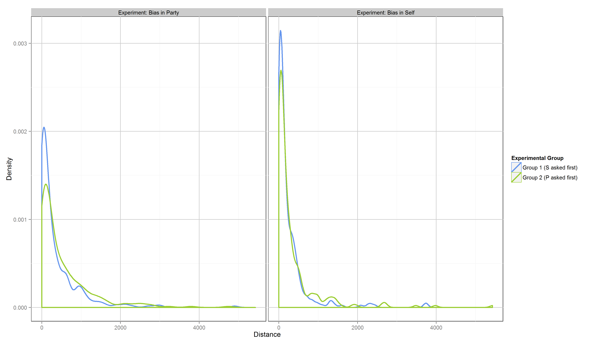

The blue line in the left panel corresponds to the control group in Experiment 1 (X) which was asked to report $S$ first. The green line corresponds to the treatment group (Y). In the right panel the blue line corresponds to the treatment group in Experiment 2 (Z), while the green line displays the density for the control group ($W$). It is obvious that the distributions in the two experiments have to be modelled with different distributions[^transforamtion]. I conduct all statistical analyses in a Bayesian framework. 

For Experiment 1 I follow @kruschke2013bayesian and model the data with a t-distribution:

$$ X \sim T(\nu, \mu_1, \sigma_1) $$
$$ Y \sim T(\nu, \mu_2, \sigma_2) $$

Where $\nu$ is the parameter for the degrees of freedom (Kruschke refers to it as the normality parameter, the higher $\nu$ the closer is the distribution to a normal distribution). I use flat priors since there is no prior research that would give me information on the relevant distribution. I follow @kruschke2013bayesian in the choice of priors[^sensitivity]:

$$ \nu \sim exp(29^{-1}) $$
$$ \mu_i \sim N(0, 100) $$ 
$$ \sigma_i \sim cauchy(0, 5)I(0, +\infty) $$

Where $i = 1, 2$ $exp$ is the exponential distribution in scale parametrization, $N$ is the normal distribution, and $cauchy(0, 5)I(0, +\infty)$ is the cauchy distribution, left-truncated at 0 (I refer the reader to @kruschke2013bayesian for a more thorough discussion of these choices).

For Experiment 2 I model the data using gamma distributions:

$$ Z \sim gamma(\alpha_1, \beta_1) $$
$$ W \sim gamma(\alpha_2, \beta_2) $$
 
$\alpha$ and $\beta$ are the shape and rate parameters respectively. I will interpret results later in terms of the expectation of the distribution $\theta = \frac{\alpha}{\beta}$. The following non-informative priors are used:

$$ \alpha_i \sim gamma(1, 0.5)$$
$$ \beta_i \sim gamma(1, 0.5)$$

for $i = 1,2$.

Samples from the posteriors of both experiments have been generated using STAN (cite) with two chains with 9000 iterations each (1000 burn-in). See Appendix [REFERENCE] for traceplots and other convergence diagnostics.

[^sensitivity]: The sensitivity of the results to the prior specification is reported in Appendix [REFERENCE].

[^transforamtion]: A logarithmic transformation of the data in Experiment 2 still produces non-normal data. Additionally to the less intuitive interpretation and the problem of handling the many zeros. See Appendix [REFERENCE] for the density of the transformations.

# Results

## Predictive Model

To get an estimate of $S$ in Group 2, a model is trained, that predicts the self placement from answers to issue questions. Since in Group 1 $S$ is asked before $P$ it is unbiased as defined above. I use a random forest to train the model [@breiman2001random]. Random forests have very good predictive performance. Further more, the use of random forests allows me to collect data only in two groups. To test Hypothesis 2 I compare the distances between $S$ and $S^*$ in both groups. With a normal predictive model, additional data would have to be collected, to not predict values for the data that has been used to train the model. The advantage of a random forest is, that it is an ensemble of many decision trees, each grown to a bootstrap sample of the data. The observations not contained in the bootstrap sample are called out-of bag observations for a specific tree. Therefore, for each observation, there is a number of decision trees that were fit without using these observations. For the predictions of $S$ in Group 1, a new random forest is formed for each observation, just using the trees that were fit without that observation. The predictors were selected from the American National Election Study, by training a random Forest to the complete data set using all potential predictors for ideology (on a 7 point liberal - conservative scale). I then selected the 20 most important predictors according to the permutation importance criterion. Details on this process can be found in the online appendix (Github).

Figure \ref{fig:pred} displays the predicted against the reported self placements. About 60% of the variance in $\hat{S}$ in Group one is explained by the model. Figure \ref{fig:imp} displays the predictors that have been used and their importance in the model (by how much the predictive performance decreases if the values of the variable are randomly permuted).

![Permutation importance of predictors in random forest model. Meanings of the variable abbreviatiosn can be found in Table ? in the appendix [REFERENCE]. \label{fig:imp}](../figures/main/varimp.png)

More information on the predictive model can be found in Appendix [REFERENCE]

## Model Fit

Following @gelman1996posterior I conduct posterior predictive checks to asses the fit of the model assumed for the data. Figure \ref{fig:post_pred} displays a graphical test. The red lines represent the density of the observed outcome variables for both groups in both experiments. The blue lines are draws from the posterior predictive distribution at a random sample of 100 iterations of the MCMC sampler. The model fits the observed data very well.

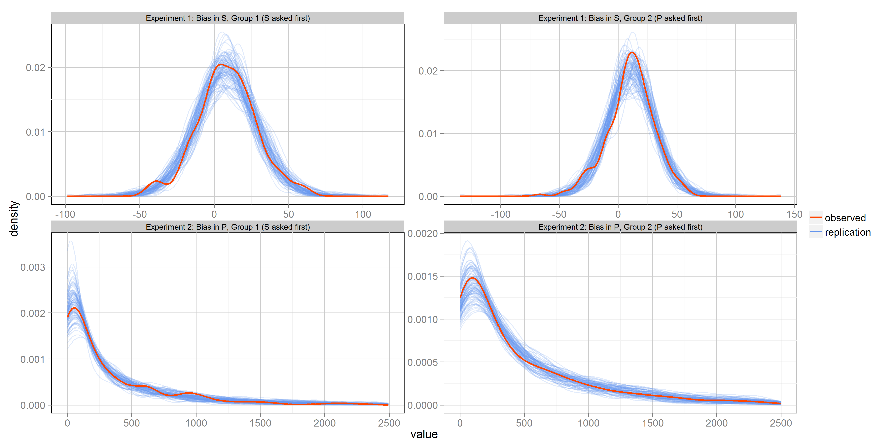

\clearpage

## Hypotheses

Figure \ref{fig:mean_diff} summarizes the results of the statistical analysis. The two panels on the left correspond to Experiment 1 the panels on the right to Experiment 2. The first row displays the posterior distribution of the difference in means: $\bar{X} - \bar{Y}$ and $\bar{Z} - \bar{W}$. The second row shows the ratio of means: $\bar{X} / \bar{Y}$ and $\bar{Z} / \bar{W}$. The area shaded in blue is the probability mass for the respective hypothesis, the red area against. Given the priors and the assumed model, the probability that there is a bias in the hypothesized direction (differences smaller 0 and ratios smaller 1) in Experiment 1 is $0.96$. The probability for an effect in experiment 2 is $0.997$. 

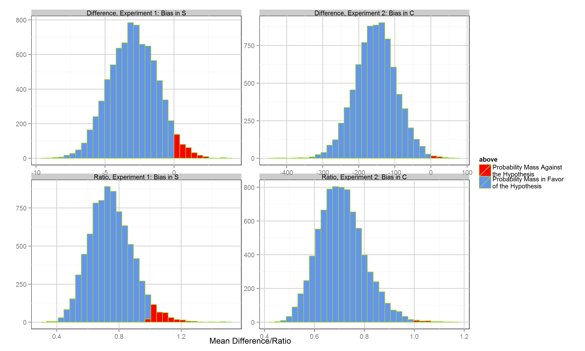

Table 2 displays the posterior means and 95% credibility intervals for all parameters. The first seven entries correspond to Experiment 1, the others to Experiment 2.  The average treatment effect as described above is about $0.7$ in both experiments. This means, that in Experiment 1 the distance between predicted ($S^*$) and reported ($\hat{S}$) position in direction of the preferred party is on average 30% higher in the group where the preferred party's position is asked first. In Experiment 2, the distance between self placement and candidate placement is on average 30% smaller due to bias in $\hat{P}$. 

\input{res_table.tex}

# References

# Appendix

## Sample Description

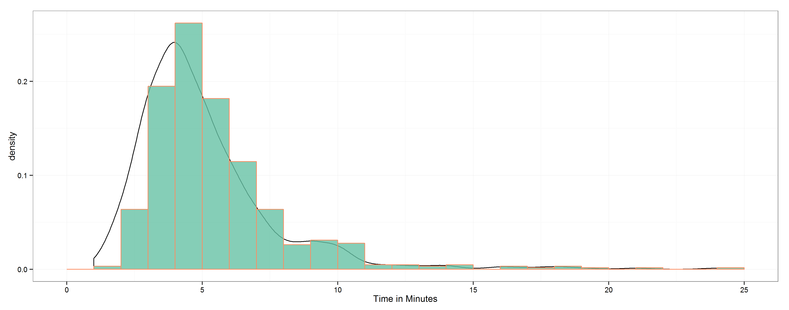

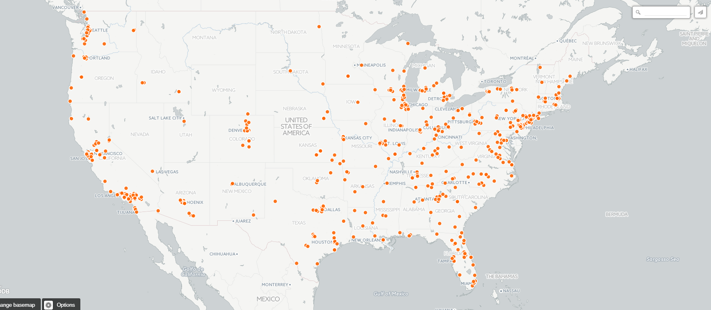

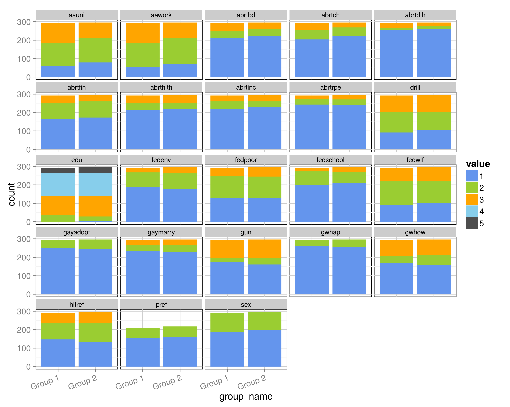

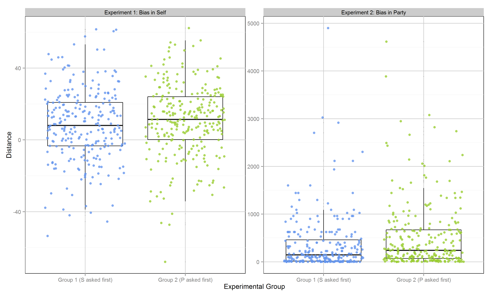

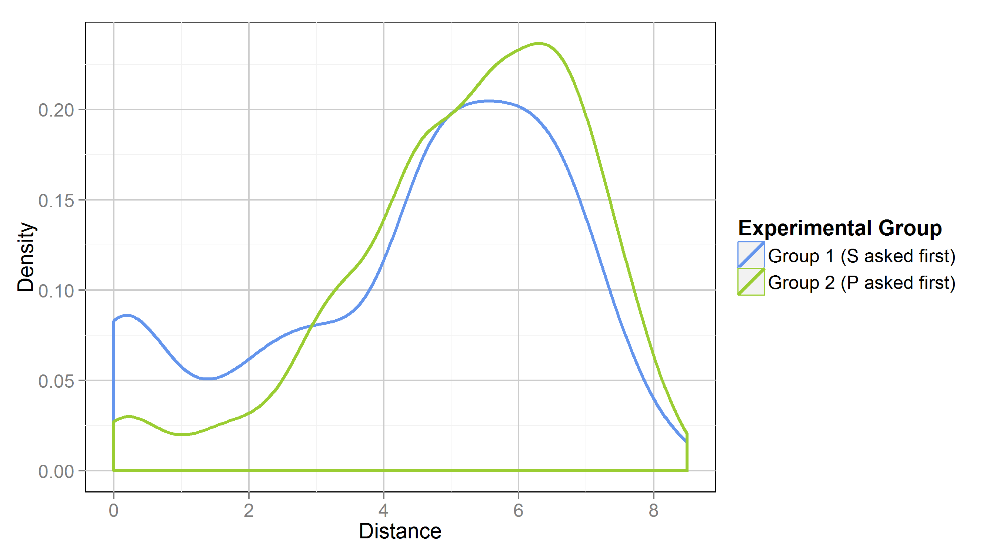

## Predictive Model

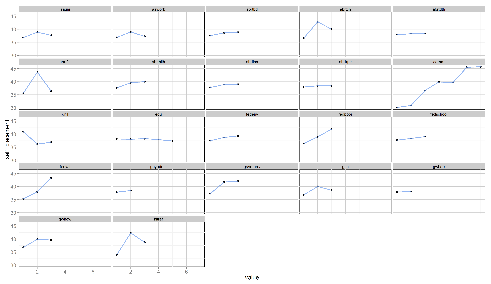

\input{predictor_table.tex}

## Prior Sensitivity

\input{res_r_table.tex}

## MCMC Diagnostics

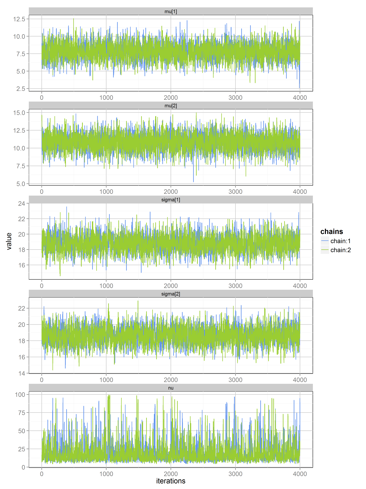

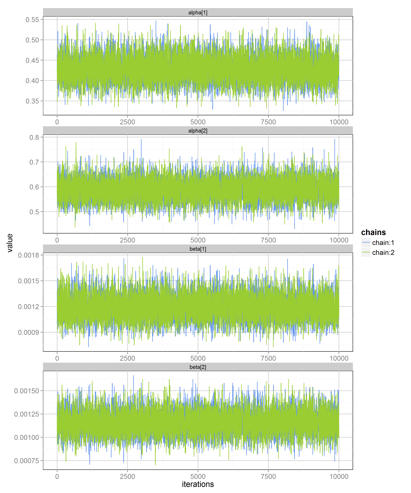

## Frequentist Parametric Tests

## Non-parametric Tests

