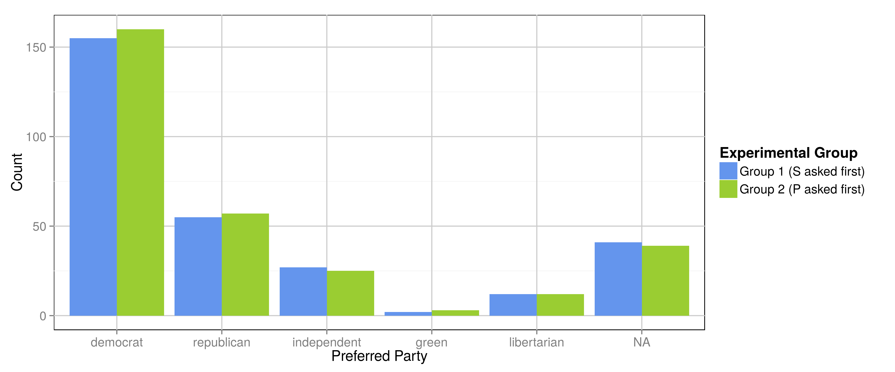
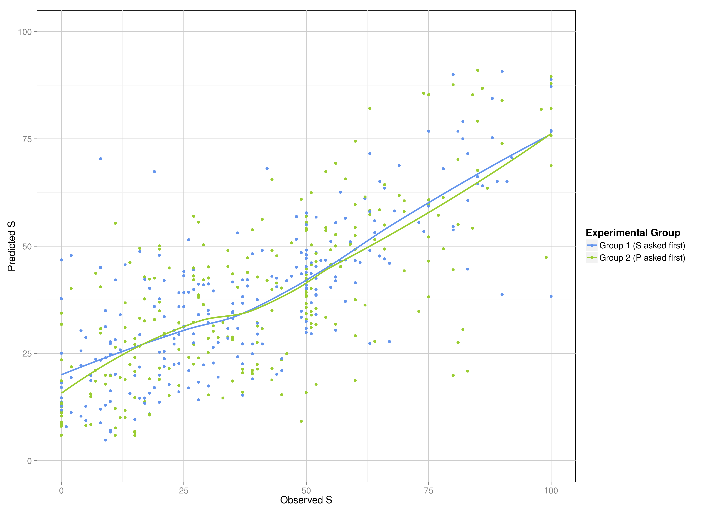
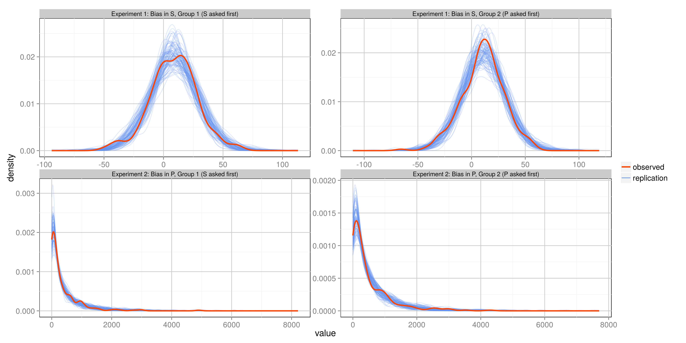

% Bias in Ideological Self and Party Placement. The Consistency Effect.
% Fridolin Linder[^affiliation]

\begin{abstract}
Research in political science has accumulated evidence that shows that individuals do not pay much attention to and are poorly informed about politics. Furthermore, the literature on source cues showed that instead of having fixed positions on issues and choosing parties or candidates accordingly, individuals change their positions when provided with information about the stance of parties on the issue. These findings have been combined in a theory of heuristic decision making that allows the uninformed electorate to make informed decisions by using source cues. In this study I show that part of the effect of source cues can not be attributed to information effects but is rather due to consistency bias. I argue that due to the multidimensional nature of the space in which citizens' decisions on parties and candidates take place, when asked to evaluate parties on only one dimension, often discrepancies between self position and reported party position have to be revealed. If the subject has positive affect towards this party, cognitive dissonance arises, which can be mitigated by misreporting either their own or the party's position. In two experiments I find evidence, that citizens do bias their own and their preferred party's position towards each other when asked to report them together. These findings affect the normative interpretation that is often given to top-down effect such as source cues, in that they contradict a normatively desirable interpretation as information shortcuts.
\end{abstract}

[^affiliation]: Pennsylvania State University.
[fridolin.linder@psu.edu](mailto:fridolin.linder@psu.edu). All replication materials and supporting materials can be found at [https://github.com/flinder/rationalization](https://github.com/flinder/rationalization). Fridolin Linder is supported by
the National Science Foundation under IGERT Grant DGE-1144860, Big Data Social
Science. I thank Matthew Golder, Christopher Fariss, Luke Keele, Patrick Kraft,
Charles Crabtree and Zachary Jones for comments. This paper was presented at the
2015 annual meeting of the Midwest Political Science Association.

\clearpage

# Introduction

A well established finding in political science is that people do not pay much attention to politics or inform themselves about issues in the political arena [@carpini1997americans; @converse1962nature; @lazarsfeld1968peoples; @campbell1960american]. The negative implications of these findings for normative theories of democracy, have been mitigated by studies that showed that individuals are able to still make informed decisions by using heuristics and information shortcuts [e.g. @chaiken1989heuristic; @tversky1974judgment]. A prominent and well studied heuristic are source cues. Source cues - information about the candidate or party that holds a position on an issue - influence the position individuals take on that issue, depending on the affect the individual has towards the source [e.g. @goren2009source; @nicholson2012polarizing; @lau2006voters; @mondak1993source; @mondak1993public; @rahn1993role; @kam2005toes; @arceneaux2008can; @boudreau2009closing]. In this study I provide empirical evidence that suggests that part of the effect of source cues cannot be interpreted as a normatively desirable information shortcut, but instead is due to consistency bias. 

In situations where voters do not have sufficient information, source cues can help them to still make informed decisions [e.g. @druckman2001using]. This is, depending on the affect the subject holds towards the cue giver, she is either more or less inclined to agree with the position of the cue giver. The effect of source cues is mostly interpreted as an information effect. If asked about an unknown or complicated issue, subjects partly infer their own position from the source's position, assuming that the own values are aligned with a preferred group and therefore inferring information from the cue. Even for other theoretical explanations that do not explicitly rely on the heuristic -- systematic information processing model and draw on group identity theory or differing factual attribution and moral criteria, information plays a crucial role [@cohen2003party; @nicholson2012polarizing]. 

While the information effect is well established, little attention has been focused on short term consistency effects. That is, individuals might move their own position towards their preferred candidate or party, not only, because they receive information from the cue, but also because they want to appear consistent in their attitudes [@cialdini1995preference]. This effect will be even stronger, if they have to report their party preference along with their own position. 

In this study I concentrate on this consistency bias that is introduced, so I hypothesize, through cognitive dissonance that is invoked by the process of having to report opinions that differ from the stance of the preferred party or are close to a disliked party. I argue that due to the multi-dimensionality of the space in which political choices take place and due to the small number of options a citizen can choose from, there will almost always be discrepancies between a hypothetical personal ideal point and the perceived position of the preferred party. When asked to report opinions on an issue, and supplied with information about the party's stance on that issue (or asked to report the perceived stance of the party on that issue first) these discrepancies have to be revealed and openly admitted. Since individuals have a need to appear consistent this fact will produce cognitive dissonance [@cialdini1995preference]. In order to reduce this dissonance, subjects will try to move either their own position or, if no external information on the party stance is provided, the position they report for the party, depending on their affect towards the party.

Using an experimental design, I will isolate and estimate the magnitude of the consistency bias that is evoked when asking subjects to state their party preference, that party's ideological position and their own ideological position on a liberal conservative scale. This design allows to estimate the consistency effect in isolation because no external information is provided. With the use of a machine learning algorithm[^algo] to predict individual level self reported ideology from political issue questions I am able to estimate average individual biases in order to quantify the magnitude of the consistency bias.

[^algo]: I am using a random forest, which is very well suited for tasks where the main goal is accurate prediction [@breiman2001random].

I find a weak consistency bias in the self reported positions and a strong consistency bias for the reported party positions. These findings have implications for our understanding of source cues: part of the effects that have been found in previous studies might be due to consistency bias and can therefore not be interpreted as an information shortcut. In experiments that show the effect of source cues,  This again has implications for normative interpretation of source cues. They can be seen either as beneficial shortcuts, that allow citizens to make informed decisions without investing many resources, or biases that allow political elites to influence the electorate. My results give more weight to the latter interpretation. 

Furthermore, the results of this study have implications for the measurement of political ideology. In many public opinion surveys or political science experiments, self reported ideology is measured in conjunction with party preference and perceived party positions. In this study I show that the measurement of both, self reported positions and perceived party positions can be significantly biased. 

# Source Cues and Information Effects

Political science research has focused much attention on the formation, expression and effects of political attitudes. In classical rational choice theory preferences are conceptualized as exogenous caused of choice, and the space in which preferences exist is an issue space [@downs1957economic; @enelow1989general]. Especially in the field of political psychology the understanding of preferences has been extended in two ways. First, the definition of the relevant space has been extended: It has been found that in relation to choice more dimensions are relevant than just the "rational" issue dimensions. Research suggests that many other factors such as party identification [@campbell1960american] and other heuristics to simplify the complex political reality [@lau2006voters], personality traits of candidates [@huddy1993gender; @king2002leaders] or non-verbal cues like physical appearance, voice frequency, or charisma [@olivola2010elected for an overview] influence preference or vote choice. Second, the theoretical "degrees of freedom" have been extended. In the classical rational choice setting both the individual preferences and the position of a candidate or party are fixed, the only free parameter is the choice (which is assumed to be found by choosing the candidate or party that minimizes that distance). In the psychological literature, the individuals position in the relevant space is not fixed, but can be a function of other factors. 

A well established example of this comes from the literature on source cues [e.g. @nicholson2012polarizing; @goren2009source; @cohen2003party]. Individuals, when asked about their opinion on an issue report differing preferences when presented with information about what political actor holds this preference. In most of these experiments, individuals in the control group are presented with the 'neutral' issue and are asked to report their opinion or position on this issue. Subjects in the control group are presented with a cue, for example, 'Democrats think that ... ', followed by the issue. It has been consistently found that these cues influence what subjects report to think about the issue. The direction of the effect, that is does a cue by a certain group make the subject agree more or less, depends on the affect towards the cue giver. A democrat, for example, would be more likely to agree to the issue if it contains the cue that democrats hold that opinion, while she would be less likely to agree if a republican cue was given. 

Individuals with higher levels of political information are less likely to rely on source cues when reporting their positions, and the effect of source cues is stronger on issues that are complex or not well known [@kam2005toes; @lupia1994shortcuts; @mondak1993public; @arceneaux2009educating]. While the empirical evidence for an effect of source cues on expressed opinion is unambiguous, several theoretical explanations have been proposed for it. The fact that source cues show their strongest effect in low information groups and on new and not established issues, is often interpreted as evidence for heuristic processing [@lau2006voters; @chaiken1980heuristic, @lenz2009learning]. Most individuals are not very involved in politics and do not want to spend cognitive resources to systematically process political information about parties, candidates and issues. Party cues offer a shortcut, where the subject simply relies on her affect towards the source cue to make up her mind about the issue, assuming that the own preferences are aligned with preferred groups and not aligned with disliked groups [@lau2001advantages].

However, even on well known and established issues and among politically informed subjects source cue effects have been shown [@nicholson2012polarizing; @lau2001advantages]. @nicholson2012polarizing proposes group identity theory as an explanation. Individuals want a positive in-group identity while keeping the own in group distinct from others. So just the fact that an issue or position is held by the in-group evokes more positive feelings for it and therefore produces biases.

In another explanation for the effect of source cues, the perception of the issue itself is influenced by the group membership. The argument is, that most political issues do not have inherent objective value to the subject, but derive their value to the subject from their social meaning instead. The process of defining social meaning is crucially influenced by group membership [@cohen2003party; @robinson1995actual; @verplanken2002motivated]. It is assumed that other members of the same social group share similar values, which again influences how the social meaning of the issue is defined. Source cues affect this definitional process in two ways: First, they can influence the factual attributions made to the issue. An example might be that if presented with the fact that republicans want to increase taxes, a democratic subject might connect this with increased military spending, so the issue would be opposed. On the other hand if a democratic cue was given, the subject might attribute, social welfare to the issue and judge it in a positive light. Second, depending on the source cue, different moral dimensions can be activated to make a judgment. For instance, in the case of abortion, either the sanctity of life, or the rights of the mother can be invoked to justify either position towards the issue. 
However, in this theoretical explanation information plays an important role, too. The possibility for a subject to change the factual attribution or different moral dimensions depends on her information on the issue. The effect of a source cue is probably much lower for a very old and well known issue compared to a new or complicated issue.

## Consistency Bias

An explanation that has received much less attention and which is theoretically unrelated to the information processing model, is the consistency effect. In the this section I lay out a theoretical framework that explains bias in reporting of political positions, not for the reasons mentioned in the previous section but for the fact that reporting positions in only one dimension forces the subject to admit necessary discrepancies between the own position and the preferred party's position. These discrepancies cause cognitive dissonance, which the subject tries to reduce by biasing her reported position [@festinger1957prophecy].

For each individual, preferences for candidates or parties or other political elites (henceforth just parties) can be conceptualized in a $D$ dimensional space, where $D$ can vary between individuals. As discussed above, these dimensions could represent anything that is relevant in the subject's evaluation of parties. It might be positions on concrete issues, personal characteristics of candidates of that party, or might be conceptualized as aggregated ideological dimensions like economic left - right or liberal - conservative. Let the citizen have position $\mathbf{S} = [S_1, S_2, ... ,S_D]$, and each of the parties, $j = 1, 2, ..., K$ is perceived by the citizen to have position $\mathbf{P_j} = [P_{j1}, P_{j2}, ..., P_{jK}]$. If the space is exhaustive of all dimensions that are relevant for the citizen, then the preferred party is $p^* = \operatorname{argmin}_p ||\mathbf{S} - \mathbf{P_p}||$, that is, the party that minimizes the euclidian distance to the subject's ideal point. However, the solution to this multidimensional problem is not necessarily the optimum in each dimension. In other words the party closest to the position of the citizen in the $D$ - dimensional space, is not necessarily the closest party on each relevant dimension. This is illustrated in two dimensions in Figure \ref{fig:theo}. Party A is the closest, considering all dimensions together (the distance vector between the points is shorter), but party B is closer when considering the projections onto the x - axis. In other words, the individual would generally prefer party $P_1$, but if asked to evaluate the parties and herself only on Dimension 1, doing so truthfully would result in the configuration indicated on the x-axis: $P_2$ is closer to $S$ than $P_1$. However, the affect that the subject feels towards the parties, is still based on consideration of all dimensions. Therefore, this new ordering induces cognitive dissonance (or dissonance between affect and 'rationality').  Furthermore, due to the discrete nature of the optimization, the distance between the ideal point of the citizen and the ideal point of the party will often not be zero in any single dimension even if the preferred party is closest to the subject's ideal point in the dimension of interest.

\input{figures/theory_figure.tex}

If a researcher wants to measure the position of a subject in only one specific dimension, her perception of the positions of political parties on that dimension and the general party preference, the subject is forced to report these discrepancies. This is the case, because for the subject honest preference revelation equates to a projection from the multidimensional space to the single dimension the subject is asked about. As an example, consider a subject who's preference for a party is mostly driven by the fact that all her peers and family prefer this party. However, from a policy perspective, she would prefer another party. If asked to evaluate herself and the two parties on this dimension, she would have to report the disliked party closer than the preferred party. Research in social psychology showed that people have a need to appear consistent [e.g. @cialdini1995preference]. I therefore expect that depending on its size, this discrepancy will cause cognitive dissonance for the individual [@festinger1957prophecy; @brehm1962explorations].

There are several different possibilities to react to this dissonance. First, the subject might be aware of the multi-dimensionality and therefore accept the discrepancy in a single dimension. In this case no consistency bias would be expected. Second, if a party different from the preferred party appears to be closer to her own ideal point, the subject might change her expressed preference to decrease the distance. However, there might still be a discrepancy between the new party and the ideal point. Third, the subject can move their own reported position towards the perceived party position. Or fourth, the reported perceived party position can be moved towards the individual ideal point. In the latter two cases, the individual rationalizes the party preference by reporting the preferred party's perceived position and the own ideal point to be closer together than the individual would report if not all the questions are asked together [@rahn1994rationalization]. 
In this paper I will analyze the latter two options. I choose a general liberal - conservative scale as the dimension of interest (the dimension, subjects will be asked to evaluate themselves and their preferred party on). The liberal - conservative scale is still widely used in political science as a general measure of ideology, it is therefore of special interest, to check for potential biases occurring in the measurement of this construct. I furthermore expect, that most respondents have an idea of where to locate themselves and their preferred party on this scale, thereby minimizing the role that information might play and reducing the noise induced by guessing. 

If the party preference and either the own or the preferred party's position is fixed, the other position should be changed to mitigate dissonance if a consistency bias exists. Since I analyze consistency bias here, I define the unbiased position to be the position the subject would report without bias introduced through consistency effects as described above. This does not mean the unbiased position is a measurement of the 'true' ideological position. There are several other biases an problems with the measurement and conceptualization of self reported ideology (see for example the literature on anchoring [@king2007comparing]). 
 
The occurrence of such a consistency bias has implication for our theoretical understanding of the effects of party preference on issue preferences (in particular for the source cues literature) as well as for the measurement of self reported ideology and perceived party positions. The implications for the theoretical understanding of source cue effects are threefold: First, the consistency bias shown in this work is solely stemming from the measurement of party preference, self and party position. This would imply, that the measurement procedure of the source cue literature alone might invoke a consistency bias. Therefore, part of the bias towards the preferred party in these studies might be due to consistency effects in the measurement and not due to information effects. Second, the result would hint at consistency bias as another potential mechanism that might explain part of the source cue effects, in a theoretical sense, hence separate from the effect that is invoked by the measurement. In other words, the existence of the measurement effect, demonstrates the basic psychological mechanism that drives subjects to move their own position or preference towards a party exist. However the experiment in this study gives no direct evidence for source cue effects 'in the real world', i.e. not just in the survey. Third, source cue effects, in all studies that I am aware of, just concentrate on the biases in the *subjects'* reported positions, while party positions are fixed by the researcher. The theory laid out here, however, would suggest that cognitive biases also operate on the perceptions of parties if the self position is fixed or sufficiently constrained. 

# Research Design

I use an experimental design to evaluate the existence of consistency bias in the US context. Although the US political landscape is dominated by the two major parties, the basic mechanism of consistency bias should apply regardless of the number of parties in the political system[^party], however the magnitude might be influenced by it. In order to test if subjects decrease dissonance by biasing either their self reported position or the perceived party position on a liberal - conservative scale, I fix their party preference and one of the two reported positions. I achieve this by asking the subjects to answer the questions for the measures that are to be fixed first. Since I want to asses the bias in reported self position and reported party position the subject is always asked first, which party she prefers most. This means I assume that reporting of the party preference does not influence (in the sense of consistency bias) the reported self or party position by itself. I argue that this assumption is justified because the discrepancy is only revealed after the second position is asked, too. After the party preference has been assessed, individuals are asked to place themselves and their preferred party on a continuous liberal - conservative scale, where the order depends on which position is to be fixed. 

[^party]: Many subjects in the experiment actually indicated other parties than the republicans and democrats as their preferred party (see Figure \ref{fig:pref}).

I define the individual's unbiased position ($S_i$) as the position that respondent $i$ would report when asked to place only herself on the ideological dimension and the party's unbiased position ($P_i$; as perceived by respondent $i$) as the position the respondent would assign if asked to rate only the party. Note, that this does not mean that I assume these positions are unbiased in the sense of the 'true' ideology value. Unbiased in this design means just free of consistency bias introduced through the mechanisms described in the theory section[^assumption]. I denote the reported positions as $\hat{S}_i$ and $\hat{P}_i$ for individual and party positions respectively. Figure \ref{fig:DGP} displays graphically the two scenarios of how consistency bias in one dimension can occur. 

[^assumption]: This implies the assumption, that the individual does not consider the preferred parties position in the self placement or, more likely, the self placement in the placement of the party. In other words, when asked to place the party first, the subject might consider her own position, and then place the party in relation to this. In such a case, when asked to place herself next, there would be consistency bias in the *first* not in the second answer. However, this makes the design produce a conservative estimate of consistency bias, since in such a case no bias would be detected.

\input{figures/research_design_figure.tex}

If the question for $S$ is asked first and the question for $P$ is asked second, $\hat{S}$ should equal $S$ and $\hat{P}$ should be closer to $S$ than $P$. If the order of the question is reversed, $\hat{P}$ should equal $P$ and $\hat{S}$ should be biased towards $P$. In other words, depending on what question the subjects are asked first, I expect that they bias their second answer in order to decrease the distance between themselves and the preferred party. I conduct two experiments, each is designed to estimate one of these two forms of consistency bias.

## Experiment 1, Bias in $\hat{S}$

The goal of this experiment is to obtain an estimate of the bias that is introduced into the measurement of ideological self placement as displayed in Scenario 2 in Figure \ref{fig:DGP}. In the 'control group' the question for $S$ is asked first, therefore the answer is unbiased according to the definition above. In the 'treatment group' the question for $P$ is asked first. I expect that respondents in the treatment group will bias their $\hat{S}_i$ towards their $\hat{P}_i$, as indicated by the red line in Figure \ref{fig:DGP}. 

A straight forward test would be to compare the average $\bar{\hat{S}}$ in the two groups and take the difference as the treatment effect. However, since we do not know a priori, if $P_i$ lies to the left or right of $S_i$, and it might lie on different sides for different respondents, the treatment effect might be lost when just taking the average. In other words, since the $P_i$ is the position of the party that individual $i$ prefers - *as perceived by that individual* - said individual might move her reported position $\hat{S}_i$ either to the left or to the right, in order to decrease the distance, depending on where she perceives the party. Even when analyzing the data separately for individuals that prefer republicans or democrats, since there is no fixed party position, that all individuals perceive, there is no a priori reason to expect bias in either direction[^means].

[^means]: I provide some simple tests for this claim in Table \ref{tab:means} in the Appendix. The means of self and party positions in both groups and in the subsets defined by party preference are not different.

To avoid this problem and to recover the consistency bias, I will estimate the unbiased $\hat{S}$ in the treatment group from other variables: Additionally to the placement questions, all respondents are asked for their opinions on a set of recent political issue questions. Since $\hat{S}$ is unbiased in the control group, this data can be used to train a predictive model, that then can be used to estimate the unbiased self placement in the treatment group. I will denote this estimate by $S^*$ (see the section on the predictive model for more details). Once an estimate of $S$ is obtained (I denote this estimate $S^*$), this estimate can be compared to $\hat{S}$ in order to measure how much respondents in the treatment group moved their position in order to mitigate cognitive dissonance. However, interpreting the distance between prediction and reported position as completely caused by the theorized mechanism, would require the predictive mode to be perfectly accurate and no experiment would be required. Since this is obviously not the case, I will compare the inaccuracy of the model in the control group to the inaccuracy in the treatment group. More precisely I compare the inaccuracy of the model *in direction of the preferred party*:

\begin{equation}
  \label{eq:s_dist}
  D(S^*_i,\hat{S}_i, \hat{P}_i) = (\hat{S}_i - S^*_i) \operatorname{sgn}(\hat{P}_i - S^*_i). 
\end{equation}

Where $\operatorname{sgn}(.)$ is the sign function. This function returns the distance between $\hat{S}$ and $S^*$ if $\hat{S}$ and $\hat{P}$ lie on the same side of $S^*$ (as displayed in Scenario 2 in Figure \ref{fig:DGP}) and the negative distance if they lie on opposite sides of $S^*$. This means, if there is consistency bias the reported self position ($\hat{S}$) will be on average closer to the reported party position ($\hat{P}$) in the treatment group. If this is truly the case, the only possible cause for this is, that subjects in the treatment group where asked to report the party position before they report the self position. The treatment effect is then the difference between the averaged distances between reported and predicted self position:

\begin{equation}
  \label{eq:t_1}
  T_1 = \bar{X} - \bar{Y}.
\end{equation}

Where,
\begin{equation}
  \label{eq:x_y}
  \begin{split}
     \bar{X} = \frac{1}{n_c}\sum_{i \in \mathcal{C}}D(S^*_i,\hat{S}_i, \hat{P}_i) \\
     \bar{Y} = \frac{1}{n_t}\sum_{i \in \mathcal{T}}D(S^*_i,\hat{S}_i, \hat{P}_i). 
  \end{split}
\end{equation}

Where $\mathcal{T}$ is the set of all $i$ that are in the treatment group, $\mathcal{C}$ is the set of all $i$ in the control group, $n_t = |\mathcal{T}|$ and $n_c = |\mathcal{C}|$. The hypothesis for Experiment 1 is then: $H_1: T_1 < 0$.

## Experiment 2, Bias in $\hat{P}$

The goal of the second experiment is to obtain an estimate of the bias in the party placement due to rationalization described in Scenario 1 in Figure \ref{fig:DGP}. Respondents in the control group are asked to report $P$ first and $S$ second, for respondents in the treatment group the order is reversed. I assume that $\hat{P}$ in the control group is an unbiased estimate (as defined above) of $P$. According to the theory, respondents in the treatment group will bias $\hat{P}$ towards $S$. When trying to obtain an estimate of the treatment effect, the same problem as in Experiment 1 arises: since $P_i$ and $S_i$ can be arbitrarily ordered for each respondent, the treatment effect might be lost when averaging over the $\hat{P}_i$. My solution is the same as in Experiment 1. Because, $\hat{P}$ and $S^*$ are unbiased in the control group, the distance between them should be larger than the distance between $\hat{P}$ and $\hat{S}$ in the treatment group. I therefore define the treatment effect for Experiment 2 as:

\begin{equation}
  \label{eq:t_2}
  T_2 = \bar{Z} - \bar{W}.
\end{equation}

Where,
\begin{equation}
  \label{eq:z_w}
  \begin{split}
      \bar{Z} = \frac{1}{n_t}\sum_{i \in \mathcal{T}}(\hat{P}_i - \hat{S}_i)^2 \\
      \bar{W} = \frac{1}{n_c}\sum_{i \in \mathcal{C}}(\hat{P}_i - S^*_i)^2.
  \end{split}
\end{equation}

Where $\mathcal{T}$ is the set of all $i$ that are in the treatment group, $\mathcal{C}$ is the set of all $i$ in the control group, $n_t = |\mathcal{T}|$ and $n_c = |\mathcal{C}|$. The hypothesis for Experiment 2 is then: $H_2: T_2 < 0$. 

## Data Collection and Description

The sample size was determined with a simulation approach (see the online appendix for details). It was determined that at least 250 respondents per group are necessary to detect a substantively significant effect size (at least 10\% reduction in distance between the reported positions). 
The data for both experiments is collected in only two groups as laid out in Table 1. In Experiment 1 $S$ is asked first in the control group and $P$ is asked first in the treatment group. In Experiment 2 the order is reversed. Therefore, I collect the data only in two 'survey groups' and use them as treatment and control according to Table 1. I label these survey groups as Group 1 (where $S$ is asked first) and Group 2 (where $P$ is asked first). Because $\hat{S}$ in Group 1 is unbiased, the data collected in this group is also used to train the predictive model.

-----------------------------------------------------------------------------------
           &nbsp;              Experiment 1 (Bias in S)   Experiment 2 (Bias in P) 
----------------------------- -------------------------- --------------------------
Group 1 (S asked first)                Control             		 Treatment             

Group 2 (P asked first)               Treatment                   Control             
-----------------------------------------------------------------------------------
Table: Relation of survey groups to experimental groups in Experiments 1 and 2.

The data was collected using Amazon's Mechanical Turk (MTurk)[^preregistration]. Several studies showed that MTurk provides data of reasonable quality for research purposes [@mason2012conducting; @berinsky2012evaluating; @buhrmester2011amazon]. MTurk workers are redirected to a Qualtrics survey to complete the experiment. The specific survey questions are available online[^surveys]. Respondents were given equal probability to fall into Group 1 or Group 2. Respondents were required to be older than 18 years and to live in US (some workers
had US accounts but foreign IP addresses, those users where excluded). Furthermore, respondents that reported to have no party preference were excluded. The final sample used for analysis consists of 508 respondents (Group 1: 251, Group 2: 257), the mean age is 33.4 years (33.7, 33.3) and 64.5\% of the respondents are male (64.1, 65.0). Figure \ref{fig:pref} displays the distribution of party preferences (before respondents without preference have been excluded). It is apparent that the sample is skewed towards the democrats and other parties and away from republicans. More description of the sample and information on the balance of the groups can be found in the Appendix (Figures \ref{fig:time}, \ref{fig:map} and \ref{fig:bal}).

In order to assure good quality of the data I included two attention checks throughout the survey, in which respondents where hidden in somewhat longer introduction, respondents where asked to answer the question in a specific way that would be very unlikely to be chosen by someone randomly checking answers [@berinsky2012evaluating]. Less then 5\% of the respondent failed to pass the attention checks. I furthermore tracked the time spent on each question. Overall I conclude that most respondents took the task seriously and answered the questions carefully.  

[^preregistration]: The study has been preregistered. The preregistration is in form of a frozen branch of the Github repository that contains all work related to this project. It can be viewed under <https://github.com/flinder/rationalization/tree/pre_registration> It contains all public files pertaining to the study, before the main data collection began. Although not all details have been fixed in the pre-registration, the general hypotheses and the research design are unchanged. Due to mistakes in the pre registration I had to change the measure of distance in Experiment 1. I also conducted the analyses in a Bayesian instead of a frequentist framework.

[^surveys]: <https://github.com/flinder/rationalization/tree/master/surveys>

\clearpage

## Predictive Model

To get an estimate of $S$ in Group 2, a model is trained, that predicts the self placement from answers to issue questions. Since in Group 1 $S$ is asked before $P$ it is assumed to be unbiased as defined above (no consistency bias). I use a random forest to train the model [@breiman2001random]. Random forests have very good predictive performance [@hastie2009elements]. Further more, the use of random forests allows me to collect data only in two groups: To test Hypothesis 2 I compare the distances between $S$ and $S^*$ in both groups. With a standard predictive model, additional data would have to be collected, to avoid making predictions for the same data that has been used to train the model (which would overfit the data and therefore overstate the accuracy of the predictions). A random forest has the advantage, that it is an ensemble of many decision trees [@hastie2009elements], each estimated using only a bootstrap sample of the data. A bootstrap sample, is a sample *with replacement* of the same size as the original data set.  The observations not contained in the bootstrap sample are called out-of bag observations for a specific tree. For these observations, the tree can be used to make a prediction that is not based on information of said observations. For the predictions of $S$ in Group 1, a new random forest is formed for each observation, just using the trees that were fit without that observation[^ensemble]. 

[^ensemble]: Other ensemble methods that are based on bootstrap samples of the data have the same advantage. Boosted regression and classification trees are such a method [@friedman2001greedy]. In comparison, the methods perform about equally well in terms of generalization error and mean squared error on the training data (see the online materials for additional information).

The predictors that are asked in the survey experiment were selected prior to the data collection from the American National Election Study, by training a random forest to the complete data set using all potential predictors for ideology (on a 7 point liberal - conservative scale). I then selected the 20 most important predictors according to the permutation importance criterion[^imp]. These predictors are mostly questions on classical ideologically salient political issues like abortion, gun rights, and environmental protection, etc. Details on this process can be found in the online appendix.

[^imp]: Permutation importance is defined as the increase in predictive accuracy if the variable of interest is randomly permuted. It is therefore a very suitable criterion to select variables for a model that has to achieve predictive accuracy, as in the present research design.

Figure \ref{fig:pred} displays the predicted against the reported self placements. About 60\% of the variance in $\hat{S}$ in Group 1 is explained by the model. At a first glance this might seem not very much, however it has to be kept in mind that ideology is not a very well defined concept, especially not for survey respondents. However, the predictions do not have to be perfect for the basic logic of the research design to work. If there is a treatment effect, the predictive model will be less accurate in Group 2 (the treatment group in experiment 1), due to the consistency bias it can not account for. More precisely it will be less accurate in the direction of the preferred party (see Equation \ref{eq:s_dist}). 
Therefore, the variance of the prediction is less important than its bias. In order for the logic of the research design to work, it is crucial that the prediction of the model is on average unbiased. The average distance between $\hat{S}$ and $S^*$ in Group 1 is $-0.27$ on a scale from 0 to 100. Note that this residual average is based on the out of bag data. That is, the prediction error for each observation is calculated using only the trees that have been fit without this particular observation. Therefore, a similar error can be expected for the observations in Group 2, that have not been used to train the model. Since the predictions are accurate on average, I conclude that they can be used in the way proposed in the research design. Additional information on the predictors, their importance and their relationship to self reported ideology can be found in Table \ref{tab:predictors}, Figure \ref{fig:imp}, and Figure\ref{fig:pd} in the appendix

## Analysis and Statistical Model

With the estimates $S^*$ obtained from the predictive model, the outcomes of interest ($X, Y, Z, W$) can be calculated, as described in Equations \ref{eq:x_y} and \ref{eq:z_w}. Figure \ref{fig:d_dist} displays the distribution of the outcome variables in both groups and both experiments. The panels correspond to the experiment and the colored lines to the experimental groups. The density lines correspond to the random variables defined in the research design section. 

The blue line in the left panel corresponds to the control group in Experiment 1 (X) which was asked to report $S$ first. The green line corresponds to the treatment group (Y). In the right panel the blue line corresponds to the treatment group in Experiment 2 (Z), while the green line displays the density for the control group ($W$). The distributions of the outcomes of Experiment 2 are very right skewed, only positive and have very long tails to the right. Since the standard t-test requires normality, this data can not be analyzed in this form. One approach would be to apply a logarithmic transformation to the data. The problem is that the outcomes contain many zeros, and the unit of the outcome becomes less intuitive. Furthermore, when adding a small amount to the data to solve the problem of many zeros, the data is still non-normal and left skewed (Figure \ref{fig:d_dist_log} in the Appendix displays the transformed density, KS-Test for normality p < 0.0001). The distributions for the outcomes of Experiment 1, look like normal distributions, however, statistical tests for normality reject the null hypotheses of normally distributed outcomes (see Table \ref{tab:ks} in the Appendix).  

In order to avoid conclusions that are based on false parametric assumptions, I will model the data in a Bayesian framework, in which I can easily choose more flexible distributions. Furthermore, in comparison to a non-parametric approach, the assumption of models for the data allow for an intuitive and probabilistic interpretation of the results[^np]. The adequacy of the assumed models can be checked using posterior predictive checks (see the section Model Fit).

[^np]: Another approach would be to use frequentist non-parametric alternatives, like the Wilcoxon rank test. I replicate my results with such methods in Table \ref{tab:np_res} in the Appendix.

For Experiment 1 I model the data with a t-distribution. The t-distribution is more flexible than the normal distribution, due to an additional parameter that allows for heavier tails. It further more has been used extensively in the analysis of simple Experimental data [@kruschke2013bayesian]:

\begin{equation}
  \label{eq:x_y_dist}
  \begin{split}
      X \sim T(\nu, \mu_1, \sigma_1) \\
      Y \sim T(\nu, \mu_2, \sigma_2) 
  \end{split}
\end{equation}

Where $\nu$ is the parameter for the degrees of freedom (the lower $\nu$, the heavier the tails of the distribution). I use uninformative priors since there is no prior research that would give me information on the relevant distribution: $\nu \sim exp(0.001)$, $\mu_i \sim N(0, 1000)$, $\sigma_i \sim IG(1, 1)$. Where $i = 1, 2$, $exp$ is the exponential distribution in scale parametrization, $N$ is the normal distribution, and $IG$ is the inverse gamma distribution.

For Experiment 2 I model the data using gamma distributions:

\begin{equation}
  \label{eq:z_w_dist}
  \begin{split}
      Z \sim GA(\alpha_1, \beta_1) \\
      W \sim GA(\alpha_2, \beta_2)
  \end{split}
\end{equation}
 
$\alpha$ and $\beta$ are the shape and rate parameters respectively. I will interpret results later in terms of the expectation of the distribution $\theta = \frac{\alpha}{\beta}$. The following noninformative priors are used: $\alpha_i \sim GA(0.0001, 0.0001)$, $\beta_i \sim GA(0.0001, 0.0001)$, for $i = 1,2$.

Samples from the posteriors of both experiments have been generated using \texttt{rSTAN} [@rstan-software:2014] with two chains with 9000 iterations each (1000 burn-in).

[^sensitivity]: The sensitivity of the results to the prior specification is reported in Appendix.

# Results

## Model Fit

Following @gelman1996posterior I conduct posterior predictive checks to asses the fit of the model assumed for the data. Figure \ref{fig:post_pred} displays a graphical test. The red lines represent the density of the observed outcome variables for both groups in both experiments. The blue lines are draws from the posterior predictive distribution at a random sample of 100 iterations of the MCMC sampler. This means, the blue lines are simulated data from the assumed distribution using the parameters from the current draw of the MCMC sampler. The posterior predictive check provides information on the adequacy of the assumed model for the data. If the data simulated from the posterior predictive distribution has a very different shape from the data actually observed, the model does not fit the data well. In this case, as can be seen in Figure \ref{fig:post_pred}, the data simulated from the assumed models correspond with the observed data very well. That is, the red line is covered well by the simulated blue lines. This confirms, that the assumptions made in Equations \ref{eq:x_y_dist} and \ref{eq:z_w_dist} are justified.

## Hypotheses

Table \ref{tab:res1} displays the parameter estimates for Experiment 1. $\mu_1$ and $\mu_2$ correspond to the estimates for the mean in Groups 1 (Control, $S$ is asked first) and 2 (Treatment, $P$ is asked first), respectively. $\mu_{diff}$ and $\mu_{ratio}$ correspond to the difference and ratio of means between Group 1 and Group 2. The columns $2.5\%$ and $97.5\%$ indicate the 95\% credible intervals for the parameters. The average distance between the reported self position and its prediction in the treatment group ($P$ is asked first) is two points or 20\% larger than in the control group. 

\input{tables/res_table_1.tex}

This means that respondents on average, move their self reported position towards the position that they reported for their preferred party. This difference could also be due to random variation in the accuracy of the prediction. To understand the uncertainty of this estimate, the left two panels in Figure \ref{fig:mean_diff} display the posterior distribution of the difference in means and the ratio of means for Experiment 1. I display the results in terms of the ratio, too, to make interpretation of the effect sizes more intuitive. A treatment effect in the expected direction is present, if the ratio between the estimated group means is smaller than one. In Figure \ref{fig:mean_diff} the area shaded in blue is the probability mass in favor of the respective hypothesis, the red area is the probability mass against it. Given the priors, the assumed model and the data, the probability that there is a bias in the hypothesized direction (differences smaller 0 and ratios smaller 1) in Experiment 1 is $0.92$. Meaning there is a probability of $0.08$ that there is no effect or an effect in the opposite direction. This relative uncertainty is also reflected in the fact that the 95\% credibility intervals for $\mu_{diff}$ and $\mu_{ratio}$ include 0 and 1 respectively. The estimated probability for a substantively significant effect - which I define as an increase in distance between prediction and reported position of at least 10\% - is 0.71. In sum, the substantive effect is not very large but there is evidence for consistency bias, however not extremely strong.

Table \ref{tab:res2} and the left two panels of Figure \ref{fig:mean_diff} display the results for Experiment 2. The parameters $\theta_1$ and $\theta_2$ are the means of the distributions in Groups 1 (Treatment, $S$ is asked first) and 2 (Control, $P$ is asked first), respectively. Again, $\theta_{diff}$ and $\theta_{ratio}$ are the difference and ratio between Group 1 and Group 2. The unit of the parameters is the squared distance between the reported position for the preferred party $\hat{P}$ and the reported self position $\hat{S}$ in the treatment group and the estimated unbiased position $S^*$ in the control group. The distance between these positions is on average 135 points or 26\% smaller in the treatment group, compared to the control group.  

The posterior distributions of $\theta_{diff}$ and $\theta_{ratio}$ show that there is a high probability that there is consistency bias in the reported party positions in the treatment group. Given the priors and the model, the probability for a consistency bias is $0.99$. The 95\% credible intervals for $\theta_{diff}$ and $\theta_{ratio}$ do not include 0 and 1 respectively. The probability for a substantively significant effect (a reduction in distance of more than 10\%) is 0.95. This means that there is a high probability, that subjects biased their reported party positions in order to decrease the distance between their own and their preferred party.

\input{tables/res_table_2.tex}

Although not expected a priori, the difference between the results for the bias in $\hat{S}$ and $\hat{P}$ makes intuitive sense. Subjects are probably less certain about the position of a party than about their own placement. Furthermore, the own ideological position might be more important for the subjects' self image causing higher resistance to misreport the own position. This might explain why it is easier to misreport the position of the party compared to the own position, resulting in larger consistency bias for the former.

# Conclusion

The literature on source cues and party identification delivered considerable evidence, that individuals positions on issues, values, and evaluations of policy are influenced by the positions political elites hold on them and the affect the individual has towards these elites. These results have often been interpreted as evidence for heuristic information processing, that allows citizens to make informed political choices even if they are not very involved in politics. In this study I showed that biases towards preferred parties can also be induced without providing subjects with information via source cues. The mere act of reporting, the own party preference, ideological position and the perceived position of the preferred party affects the reporting of ideological placements. Subjects tend to misreport either their own or the party's position, in a way that reduces the distance between the two. 

I found a stronger bias for the perceived party positions, suggesting that subjects have stronger feelings on their own positions, making it harder to change them towards the perceived party position. However, this is a post-hoc finding, that would have to be investigated further using new data. What I did not analyze in this study, but follows from the proposed theory, are polarization effects [@nicholson2012polarizing]: If subjects feel dissonance, because they appear far away from a preferred party, they should equally be caused dissonance if they are close to a disliked party. This mechanism might be less pronounced in the context of the US party system that is dominated by two parties, because there is relatively much 'space' on the dimension of interest. The likelihood of being close to a party that is disliked, is larger in a multiparty system, which would make polarization effects are more relevant factor in such systems.

My findings have implications for the normative interpretation of source cues as heuristics, our theoretical understanding of such cues and for the measurement of ideology in public opinion surveys and political science experiments. Source cues have been interpreted as a normatively desirable heuristic, that mitigates the problem of low information on political issues in the population. This means, they have been mostly interpreted as a mechanism that provides information to the electorate at low cost. However, my findings imply, that part of the effect of source cues might be due to consistency bias, which lacks this desirable normative interpretation. 

The results of this study furthermore demonstrate a very concrete issue with the measurement of ideology in surveys: If asked in close proximity and in conjunction with party preference, the answers to self reported ideology as well as perceived party ideology might be biased towards each other. This has general implications for the validity of these measures, as well as for empirical work that is based on the distance between perceived and self reported positions. One such example is the debate on proximity and directional voting, where some evidence in favor of the proximity model is based on correlations between these concepts. 

\clearpage

\input{appendix.tex}

\clearpage

# References
