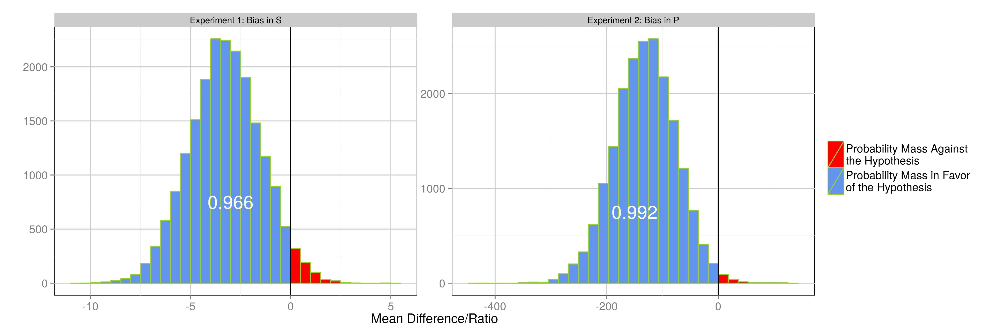

% Misreporting of Ideological Placement Through Consistency Bias
% Fridolin Linder[^frido]
% Pennsylvania State University

[^frido]:[fridolin.linder@psu.edu](mailto:fridolin.linder@psu.edu)

# Motivation

 - Is there consistency bias in self reported and perceived party ideology (when measured together)
 - Measurement perspective: Self reported and perceived ideology are commonly used measures
 - Theoretical perspective: To what degree can we interpret biases towards preferred parties as information shortcuts

# Source Cues

 - Source cues are a prominent and well studied example of bias towards liked and away from disliked actors
 - Subjects are provided with information about party position and change their own position
 - Often interpreted as heuristics that allow good decisions in low information settings
 - But how much of the bias is an **information effect** and how much is due to need for **consistency**?

# Consistency Bias

 - Political realm is multidimensional
 - Party preference is found considering all dimensions
 - There are almost always discrepancies on single dimensions

\input{theory_figure_slides.tex}

- This causes cognitive dissonance

# Expectations 

- Hypothesis: Subjects decrease this dissonance by moving self and party position towards each other

\input{research_design_figure_slides_red.tex}

# Research Design

- Fix party preference and one of the placements by asking them first (Assumption: respondent does not consider the other placement at this point)
- Ask the other placement second
- Check if the second placement is biased

Two experiments:

1) Bias in $\hat{S}$: 
    - measure party preference 
    - **control**: measure $S$
    - **treatment**: measure $P$ first, then $S$
2) Bias in $\hat{P}$: 
    - measure party preference
    - **control**: measure $P$
    - **treatment**: measure $S$ first, then $P$

# Research Design

- Ordering of positions is arbitrary, treatment effect may be lost when averaging
- Solution: Predict individual level counterfactual from issue questions ($S^*$)

\input{research_design_figure_slides.tex}

#  Research Design

Outcomes of interest:

 - Experiment 1, (bias in $\hat{S}$): 
    + Deviations from the prediction *in direction of the preferred party*
    + $(\hat{S}_i - S^*_i) \operatorname{sgn}(\hat{P}_i - S^*_i)$
 - Experiment 2, (bias in $\hat{P}$): 
    + Distance between party placement and self placement
    + Treatment: $(\hat{P}_i - \hat{S}_i)^2$; Control: $(\hat{P}_i - S^*_i)^2$

# Data

 - Pre-registered on Github (not all details)
 - Data collected on Amazon's Mechanical Turk
 - 500 subjects (high because of predictive model)

# Statistical Analysis

- Both distributions not normal
- Bayesian framework for flexibility in modeling
- T-Distribution for Experiment 1, Gamma for Experiment 2
- Quantity of interest: Difference in means

# Results I

# Results II

 - There is consistency bias in self and party placement
 - Effect size for self placement not very large
 - Bias is induced even without any information being transmitted
 - This bias could explain part of effects found in the source cue literature

# Discussion

 - Work in progress, future steps:
    + Polarization effect (bias away from disliked parties)
    + Include strength of affect towards party
    + Check for effect modifiers, especially political information
    + Include uncertainty of predictive model (maybe IRT instead of Random Forest)

# Thank You!

 - [fridolin.linder@psu.edu](mailto:fridolin.linder@psu.edu)
 - [github.com/flinder/rationalization](http://github.com/flinder/rationalization)
