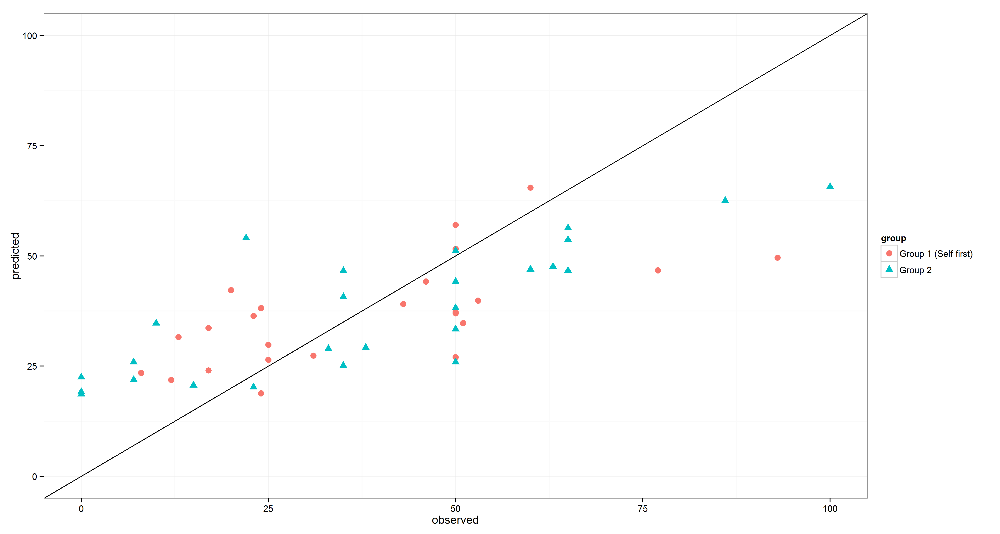

% Misreporting of ideological self placement to rationalize party preferences 
% Fridolin Linder[^contact]

[^contact]: Fridolin Linder is a Ph.D. student in political science at Pennsylvania State University ([fridolin.linder@gmail.com](mailto:fridolin.linder@gmail.com)).

Test Test Test

## Theory/Motivation

Classical theories of rational or economic voting assume that
individuals’ candidate or party preferences are a function of the
distance between their ideal point and the candidate’s ideal point in an
issue space [@downs1957economic; @enelow1989general]. However, research suggests that
many other factors such as party identification [@campbell1960american] and
other heuristics to simplify the complex political reality [@lau2006voters],
personality traits of candidates [@huddy1993gender; @king2002leaders] or non-verbal
cues like physical appearance, voice frequency, or charisma
[@olivola2010elected for an overview] influence vote choice.

Empirical support for issue based proximity preferences often relies on
high correlations between issue proximity and vote choice in
observational survey studies. Several authors have argued that these
correlations are in part due to projection or rationalization:
preferences for candidates are a causal precedent to the issue positions
[@campbell1983candidate; @rahn1994rationalization; @lenz2009learning]. In analyses of mostly panel
data, those studies found a reciprocal causal relationship between issue
proximity and candidate evaluation.

This relationship can be seen as a form of rationalization to decrease
cognitive dissonance. Issue proximity is a reasonable logical criterion
to use when deciding which candidate to support. As research in social
psychology shows, people prefer to view themselves as logical and
coherent once they are forced to reflect on their preferences (Wilson
1989). If contemplation about the candidate leads to a seemingly
incoherent preference (i.e. the preference for a candidate is based on
different criteria then the issue proximity), cognitive dissonance
arises [@festinger1957prophecy; @brehm1962explorations]. To mitigate this dissonance,
individuals might rationalize their candidate preference by changing
their own position or their perception of the candidate’s issue
position.

I propose a design consisting of two experiments to test whether this
process of rationalization occurs. Subjects are presented with real
world political parties and are asked for whom they would vote. After
that, subjects in the treatment groups are asked to place themselves as
well as their preferred party on an ideological dimension (e.g.
liberal-conservative). I define the individual’s true position ($S$) as
the position the respondent would report when asked to place only
herself on the ideological dimension and the party’s true position ($C$)
as the position the respondent would assign if asked to rate only the
party. I denote the reported positions as $\hat{S}$ and $\hat{C}$ for
individual and party positions respectively. Figure \ref{fig:DGP} displays
graphically the two scenarios how rationalization can occur. If the
question for $S$ is asked first and the question for $C$ is asked
second, $\hat{S}$ should equal $S$ and $\hat{C}$ should be closer to $S$
than $C$. If the order of the question is reversed, $\hat{C}$ should
equal $C$ and $\hat{S}$ should be biased towards $C$. In other words,
depending on what question they are asked first, I expect that subject’s
bias their second answer in order to decrease the distance between
themselves and the preferred party. Each experiment is designed to
estimate one these two forms of rationalization bias.

To measure the distance between the two positions in the control group,
the self position is indirectly measured through prediction from answers
to political issue questions. Besides the experimental groups, there
will be an additional training group, that is asked to report $S$ and
additionally answer questions about recent and controversial political
issues. From this data a predictive model (random forest) will be
trained [^1]. The issue questions will then be asked in the experimental
groups and the predictive model is used to get an estimate $S^*$ of the
‘uncontaminated’ $S$ for each individual.

[^1]: I select the predictors from the set of variables that according
    to a machine learning algorithm best predict ideological self
    placement in the American National Election Study. For additional
    information: <https://github.com/flinder/rationalization/blob/master/analysis/ideology_prediction.R>

The bias in $\hat{S}$ is measured by the distance between the prediction
and the reported position in the treatment and control group of the
first experiment. The bias in $\hat{C}$ is measured by comparing the
distance between prediction and $\hat{C}$ in the control group and the
distance between $\hat{S}$ and $\hat{C}$ in the treatment group in the
second experiment.

The paper has methodological as well as substantial implications. As
discussed above, the experiment shows if the basic psychological
mechanism that is necessary for individuals to change their position
following their preferred party exists. However, we cannot infer from
the results of the experiment, if those changes in the response have any
lasting impact on the ‘true’ ideology of the respondent. Furthermore,
the results will have implications for the measurement of political
ideology in opinion surveys. If the proposed mechanism is at work, there
is a high risk of biased measures for ideological self placement as well
as reported perceived party positions. This has important implications
for substantive research for example on the mechanisms underlying vote
choice.

## Predictive Model

The predictive model will be trained on the data from group one. Since
in group one $S$ is asked first, it is not subject to the bias proposed
here. To connect the policy questions to the reported self position, a
random forest is used. In order to get predictions for group 2, their
answers to the policy questions are dropped down the forest. To have
comparable predictions for group one, the out-of-bag prediction for each
observation is used (i.e. a prediction for an observation is made by
dropping it down only the trees that have been fit to the bootstrap
samples that did not contain this observation).

## Hypothesis Tests and Sample Size

If the necessary assumptions can be defended, the analysis will consist
of two simple t-tests, testing for significant difference between the
estimated distances between self and candidate in the two groups.

### Experiment 1: Bias in $\hat{S}$

Let $X = (S^*_1 - \hat{S}_1)^2$ be the difference between the estimate
of the true self position and the reported self position in group 1 ($S$
is asked first) and $Y = (S^*_2 - \hat{S}_2)^2$ be the same in group 2
($S$ is asked after $C$) be the random variables of interest, with
respective means $\mu_x$ and $\mu_y$ and standard deviations $\sigma_x$
and $\sigma_y$. I will collect random samples of size $n_x$ and $n_y$.
The hypotheses to test are then $H_0: \mu_x geq \mu_y$ and
$H_1: \mu_x < \mu_y$. I will use a classic two sample t-test to test
with the test statistic
$T = \frac{\bar{x} - \bar{y}}{s_p\sqrt{1/n_x + 1/n_y}} \sim t(n_x + n_y - 2)$
under $H_0$. Under the $H_1$ the test statistics follows a non-central
t-distribution with non-centrality parameter
$\lambda = \frac{\delta}{s_p\sqrt{1/n_x + 1/n_y}}$, where
$\delta = \mu_x - \mu_y$ is the effect size, and degrees of freedom
$n_x + n_y -2$. The power of the test is then,
$K(\delta) = P(T < t_\alpha|\delta, n_x, n_y, \sigma)$. Setting
$\alpha = 0.05$ and $\beta = 0.9$ and assuming an effect size of
$\delta = 0.05$ on an ideological scale from $0$ to $1$ and a standard
deviation of the squared differences of 0.06 (estimated from the data
collected in the pre run), a sample size of 25 per group would be
necessary to detect the effect.

However there are several caveates to this calculation that suggest the
need of a larger sample size. First, the variances of $X$ and $Y$ will
probably not be equal. If the suggested theory holds, variation in $X$
is due only to the prediction error of the predictive model. Variation
in $Y$ will additionally contain variation due to the bias. To mitigate
this violation of assumption sample size has to be large [see e.g.
@hogg1989probability 368]. Second, $X$ and $Y$ are not normally
distributed, therefore large sample sizes are necessary to make the
normal approximation by the central limit theorem credible. Third,
probably most importantly, the above calculation disregards the fact
that $S^*$ is an estimate obtained from a predictive model. Since this
estimation introduces additional noise into the model, more observations
are necessary to detect treatment effects. Furthermore, a large sample
is required to obtain a good predictive model in the first place. And
fourth, in case, the data does not allow for the assumptions necessary
for a parametric test, more observations are necessary to compensate for
lower power of non-parametric alternatives. After describing the
analysis for the second experiment I will present a simulation based
approach to arrive at an estimated necessary sample size.

### Experiment 2: Bias in $\hat{C}$

Let $Z = (\hat{S}_1 - \hat{C}_1)^2$ be the measure for the distance
between self and candidate in group one and $W = (S^*_2 - \hat{C}_2)^2$
be the distance in group 2[^2], with means $\mu_Z$ and $\mu_W$ and
standard deviations $\sigma_Z$ and $\sigma_W$. The hypotheses are then:
$H_0: \mu_Z \geq \mu_W$ and $H_1: \mu_Z < \mu_W$. The same test as for
experiment one can be used to test the hypothesis, given the assumptions
are met.

[^2]: Note that, if the proposed data generating mechanism is at work
    $Z^* = (S^*_1 - \hat{C}_1)^2 = Z$ should hold.

Considering the problems with classical sample size calculation
described above, I conducted a monte carlo simulation of experiment two,
in order to get sampling distributions for the statistic of interest.
Figure \ref{fig:power_sim} displays the results of this simulation[^3]. The
figure displays the distribution (95% of the mass) of the ratio of the
mean absolute differences between self position and candidate position ,
in the treatment and control group. The distributions have been
simulated for five different sample sizes (for both groups combined) and
for four different values for the average bias. The bias (effect size)
is expressed in the factor reduction of distance. That is, a respondent
with a bias parameter of 0.5 reduces the distance between the reported
self and candidate position by 50%. Assuming a reduction of at least 10%
is theoretically interesting, I conclude that a sample size of 500 is
necessary to obtain a significant difference with 95% confidence. Of
course these calculations are very rough and based on many assumptions
(see the github repository for the exact data generating process that
has been used).

[^3]: for details see <https://github.com/flinder/rationalization>

![Simulation of sampling distribution ($2.5^{th}$ to $97.5^{th}$
quantile) of the ratio of the mean absolute distance between $S^*$ or
$\hat{S}$ and $\hat{C}$ for different sample sizes ($N$) and effect
sizes (Mean Bias). The bias is expressed in the factor reduction of
distance. That is, a bias of $0.5$ means in the treatment group,
respondents decrease (on average) the distance between self and
candidate by 50%. The ratio of the absolute difference between treatment
and control group is therefore exactly this
value.\label{fig:power_sim}](figures/power_sim.png)

## Data Collection

Since a relatively large sample size is needed I will collect the data
using Amazon’s Mechanical Turk (MTurk). Several studies showed that
MTurk provides data of reasonable quality for research purposes [@mason2012conducting; @berinsky2012evaluating; @buhrmester2011amazon]. MTurk
workers are redirected to a Qualtrics survey to complete the experiment. The specific survey questions are available on github[^surveys].

[^surveys]: <https://github.com/flinder/rationalization/tree/master/surveys>

### Pre Run

In preparation for the main data collection, I conducted a test run of
the experiment with 50 participants. Mostly to test the procedures to connect Qualtrics and MTurk. Figures \ref{fig:bal} to ref{fig:prediction} show some description of the data obtained from this pre run of the experiment. However, the sample was very small so the results from the predicitve model are not very reliable (the random forest has been fit to the 24 observations in group one. Group 2 has been left out since the self position is expected to be biased in this group).

### Main study

The main study will differ from the pre run only in procedural details. Since some respondents where very quick in completing the survey I added two attention checks [@berinsky2014separating] and will track the time spent on each item. The core of the survey remained unchanged.  

### Pre Registration

This research plan will be used to pre register the study, before the main study is conducted. 

